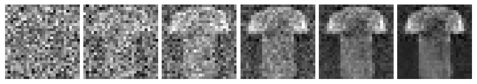

The simplest repository for training/finetuning small scale diffusion transformers. Inspired by Andrej Karpathy's nanoGPT. There two implementations: A minimal version and a scaled uup version. The minimal version allows you to train and generate images in a couple of minutes on your machine. The scaled up version of the same model can load the pretrained weigths from landmark paper [https://arxiv.org/abs/2212.09748](Scalable Diffusion Models with Transformers) to generate high quality images.

# Minimal version

Train in the fashion MNIST dataset for a couple of minutes on your machine and generate images. Training takes ~2 minutes on my M1 Macbook Pro to run 3 epochs, and you get these images. No GPU required !.



Pretrained weights: https://drive.google.com/file/d/1ChJitYTpO0gzFbd3e0h_NVrD6Tmvs2nI/view?usp=drive_link

To generate images:

```python
cd minimal_version
python3 sample.py
```

To train the model:

```python
cd minimal_version
python3 train.py
```

# Scaled up version

To generate images:

```python
cd scaled_up_version
python3 sample.py
```

The weights are downloaded automatically.
